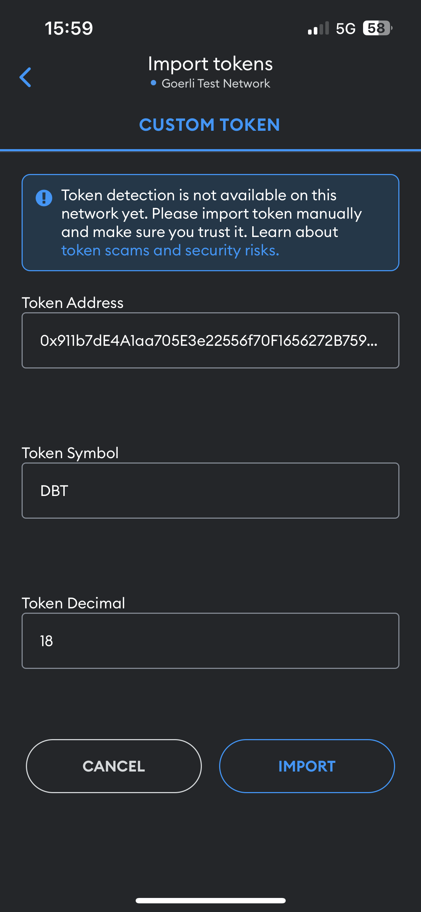

# Smart contract

Creation of a token via a smart contract usable on meta mask

# Token ID
```
0x911b7dE4A1aa705E3e22556f70F1656272B759EE
```

## Import Token on metamask

### Step 1


### Step 2



## 🔗 Links
Wallet
[Meta mask](https://metamask.io/)

Server de test
[Ganache](https://trufflesuite.com/ganache/)

Editeur de code
[Remix](https://remix.ethereum.org/)


